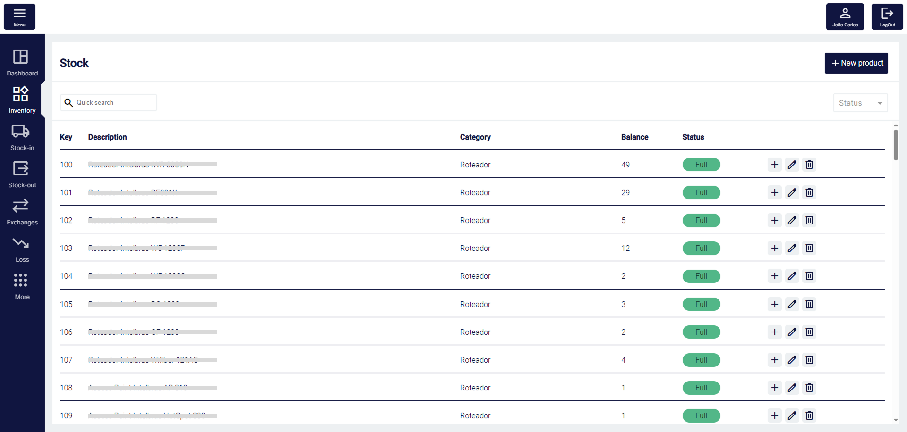
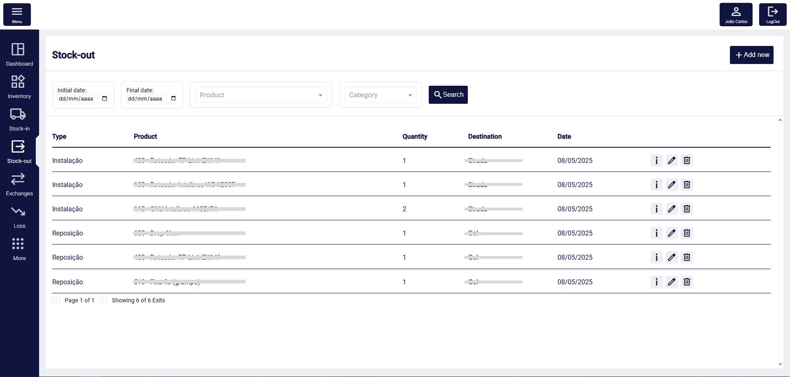
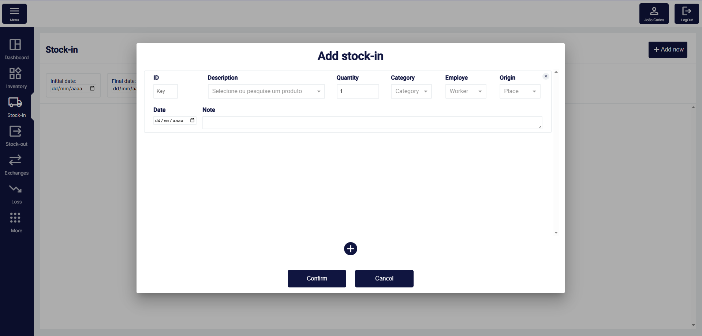

# Sistema de Controle de Estoque (Angular + Firebase)

Este projeto foi desenvolvido para uso interno na empresa onde atuo, com o objetivo de auxiliar na organização e controle do estoque da empresa. Oferecendo uma vizualização clara das movimentações, registro de entradas e saídas de produtos, e geração de relatórios mensais que ajudam diretamente nas compras para reposição pontual e precisa do estoque.

> **Por ser um sistema interno, o código-fonte não está disponível neste repositório.**

## Tecnologias utilizadas
- Angular 17
- TypeScript
- Firebase Authentication
- Firebase Realtime Database (NoSQL)
- HTML5 + SCSS
- Git & GitHub

## Funcionalidades implementadas
- Autenticação de usuários com Firebase Authentication
- Dashboard com relatório de saídas, alerta de estoque e lista de compras
- CRUD de produtos, categorias, usuários e demais entidades da aplicação
- Entradas e saídas de estoque com registro de data, origem, destino e responsável
- Relatórios mensais de saídas
- Lista de compras
- Alerta de estoque baixo ou vazio

## Interface da aplicação

### Login

### Dashboard

<!--  -->

### Inventário
 
<!--  -->

### Entradas e Saídas

### Modal de Entrada

### Configurações

